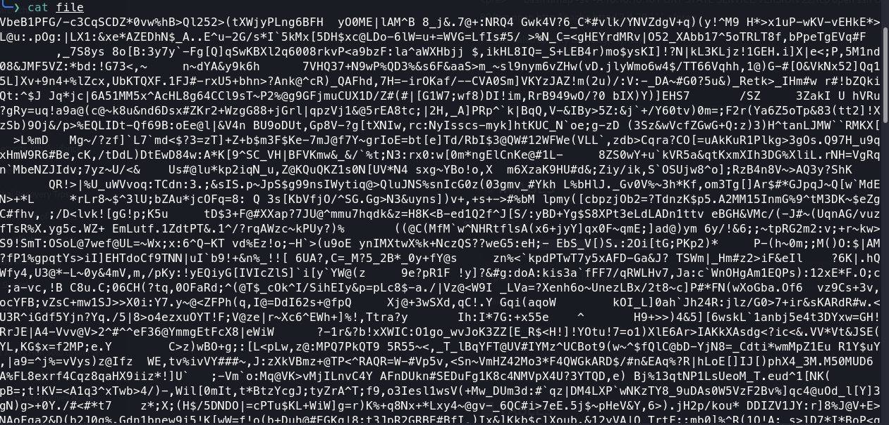

# First Grep

**Category**: General Skills
**Difficulty**: Easy

## PicoCTF Description
Can you find the flag in file? This would be really tedious to look through manually, 
something tells me there is a better way.

## Tools Used
- command line
- 'cat'
- 'grep'

## Solution
1. After downloading the given file I decided to run 'cat' command on the file to see if 
    there was any human readable code and it looked like a bunch of gibberish.

2. Since the challenge mentioned the use of 'grep' command, I figured it might be a good 
    idea to make use of it somehow. That is when I realized that I could search specifically 
    for the flag format using the following command, which ended up giving me the flag.
    - 'grep "picoCTF{" file' since this is the format of the flags for picoCTF
