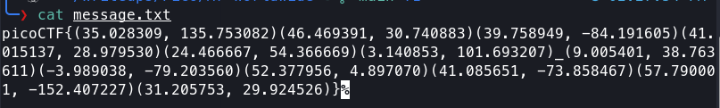

# Mr.Worldwide

**Category**: Cryptography
**Difficulty**: Medium

## PicoCTF Description
A musician left us a message. What's it mean?

## Tools Used
- command line
- google maps

## Solution
1. After downloading the given text file I decided to run 'cat' command on the file to see
    the message that was written and I got the following.

2. Looking at the output of the message I noticed that the message had what looked like coordinates
    so I decided to paste the coordinates into Google Maps for each pair of coordinates.

3. After doing this for all of the pairs of coordinates I got a bunch of different cities around the
    world so I thought that maybe the first initial of the city was the letter to use for the flag
    and so I filled it in to ge the final flag of picoCTF{KODIAK_ALASKA}