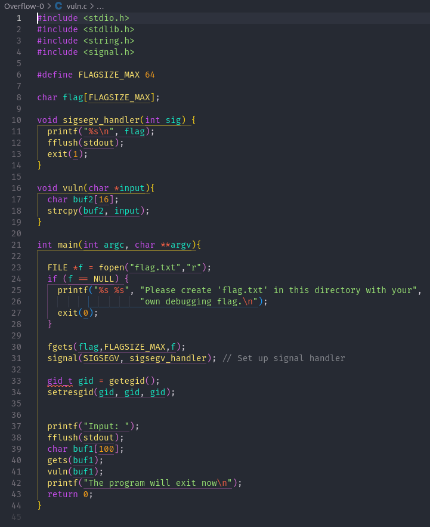

# Buffer Overflow 0

**Category**: Binary Exploitation
**Difficulty**: Medium

## PicoCTF Description
Let's start off simple, can you overflow the correct buffer? The program is available here.
You can view source here. Additional details will be available after launching your challenge instance.

## Tools Used
- command line
- 'checksec'
- VSCode
- 'nc' (Netcat)

## Solution
1. First thing I did for this challenge was to download the executable file and the source code as that
    was given to my computer so I can do more investigating on it.

2. After downloading them I decided to run the 'checksec' command on the executable to see what
    security properties the executable had and I got the following results.

    

3. The next thing I wanted to do was run the program and see how it behave. When I ran it I realized it
    asks for an input and then exits.

    

4. Since running the program did not give much insight the next thing I decided to do was look at the
    source code. So I opened the C file in my VSCode to take a further look at what the program was doing
    and how it could be vulnerable.

    

5. The key vulnerability seems to lie in the vuln() function:
    - It creates a 16 byte buffer in the stack and uses strcpy() to copy the user input into it
    - The input comes from a 100 byte buffer in main(), and there is no bounds checking before copying
    - This should allow me to do a stack overflow by overwriting the return address.

    .png) 

6. Knowing that the overflow should happen after 16 bytes and the return address is usually 4 bytes, 
    I input a 20 byte input to overwrite the return address and trigger the segmentation fault which
    printed out the flag to me.

    

7. I then booted up the instance they provided and connected to it using netcat on the port they provided and
    put in my input and got the flag successfully.

    