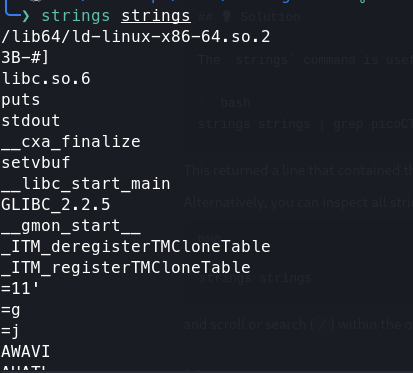
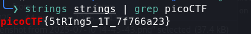

# Strings It

**Category**: General Skills
**Difficulty**: Easy

## PicoCTF Description
Can you find the flag in file without running it?

## Tools Used
- command line
- 'strings'
- 'grep'

## Solution
1. Once I downloaded the file I used strings on it in order to find human readable
    strings that were in the file to see if the flag was there. This gave me too many
    strings and did not yield anything helpful in particular.

2. Since strings gave me too long of a list and I was only looking for strings that
    have "picoCTF" in them then I decided to run the strings command on the file again
    but this time pipe it into a grep command that filters by words that contain "picoCTF".
    This then gave me the flag for this level.

    