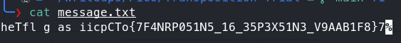
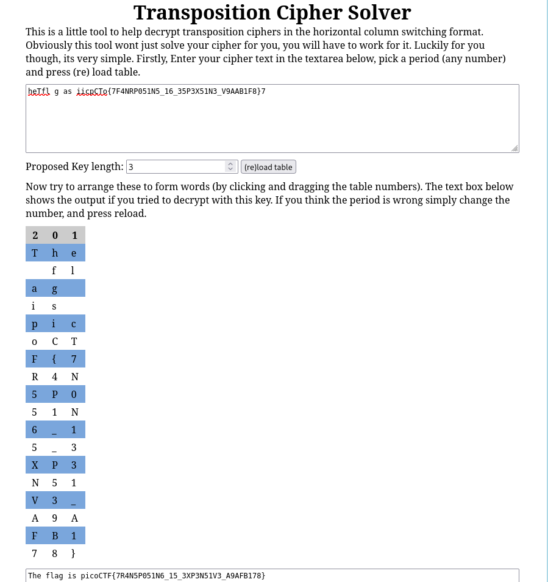

# Transposition Trial

**Category**: Cryptography
**Difficulty**: Medium

## PicoCTF Description
Our data got corrupted on the way here. Luckily, nothing got replaced, but every block of 3 got 
scrambled around! The first word seems to be three letters long, maybe you can use that to recover 
the rest of the message. Download the corrupted message here.

## Tools Used
- command line
- transposition cipher solver

## Solution
1. I downloaded the message text file and ran 'cat' on it to see the scrambled message.

    

2. Once seeing the message and paying attention to the description and the name of the challenge
    , I realized that the message was just scrambled in a transposition cipher way. I looked on
    Google for a good transposition cipher solver and found this [cipher solver](https://tholman.com/other/transposition/).

    