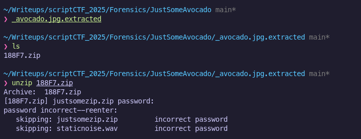
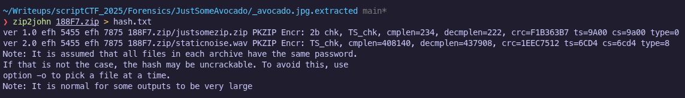
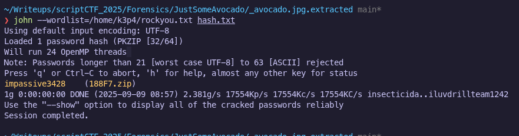

# Just Some Avocado | Connor Chang

Description: just an innocent little avocado!

avocado.jpg:attachments/avocado.jpg

## Tools Used
- `strings` - for inspection of embedded text
- `binwalk` - for file extraction
- `john` (John the Ripper) - for password cracking
- `sox` - for audio spectogram analysis

---

## Solution
1. **Initial Inspection**
    
    I opened the avocado.jpg image and visually inspected it. Nothing in the image itself appeared unusual or informative.
    

2. **Strings Analysis**  
   
   I ran `strings` on the image to look for embedded human-readable text. No useful information came up when I did this.  
   

3. **File Carving with Binwalk**  
   
   I ran `binwalk` to detect hidden files within the image. Binwalk revealed a ZIP archive embedded in the JPG:  
   

4. **Attempting to Extract the ZIP**  
   
   Extracting the ZIP file revealed that it was password-protected. Therefore, my next step was to try to extract the password.  
   

5. **Password Cracking**  
   
   I used `zip2john` to convert the ZIP file into a hash format compatible with John the Ripper. Then, I ran John with the `rockyou.txt` wordlist to brute-force the password.  
   

6. **Password Recovery**  
   
   With the help of `john`, I successfully obtained the password, allowing me to extract the contents of the ZIP. This revealed another ZIP file and a `.wav` audio file.  
     

7. **Analyzing the Second ZIP**  
   
   Attempting the same password on the second ZIP failed, indicating that a new password was needed.  

8. **Audio Analysis**  
   
   I inspected the `.wav` file. Listening to the audio produced only distorted noise, suggesting the information was hidden rather than something you can hear in the audio. Using `sox`, I generated a spectrogram of the audio, which revealed hidden text. Although the text did not look clear, it looked like it was: `"d41v3ron"`.  
   

9. **Flag Extraction**  
   
   Using the password from the spectrogram, I successfully extracted the second ZIP, revealing the flag:
   `"scriptCTF{1_l0ve_d41_v3r0n}"`
    