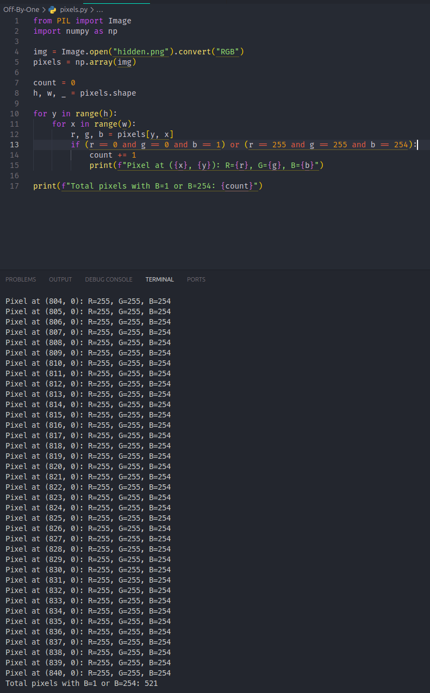

# Off-By-One | Connor Chang

Description: i hid a qr inside a qr

hidden.png:attachments/hidden.png

## Tools Used
- `strings` - for inspection of embedded text
- `zbarimg` - for extracting link from image file
- `exiftool` – for metadata analysis
- `convert` (ImageMagick) – for pixel value inspection
- `python` (NumPy) – for analyzing and modifying pixel values

---

## Solution
1. **Initial Inspection**
    
    I opened the hidden.png image and visually inspected it. The image was a QR code.
    

2. **QR Code Analysis**  
   
   I ran `zbarimg` on the QR code. It extracted a YouTube link that led to Rick Astley’s famous video (Rick Roll).
   

3. **Metadata Analysis**
    
    To confirm there was nothing hidden in the metadata, I ran `exiftool` on the image. The file only 
    contained standard image metadata, so I shifted focus to the image data itself.  
    

4. **RGB Pixel Values Analysis**
    
    Using ImageMagick’s `convert`, I inspected pixel values. Many of the pixels that should have been 
    white `(255, 255, 255)` were actually `(255, 255, 254)` — just one value off.
    

5. **Counting Off-By-One Pixels**
    
    I wrote a small Python script to count these altered pixels. The script confirmed that there were several hundred of them.
    

6. **Correcting Pixel Values**
    
    Since the challenge was called *Off-By-One*, I suspected the solution required fixing those pixel values. 
    I wrote another Python script to correct `(255, 255, 254)` to `(255, 255, 255)`.
    

7. **New QR Code**
    
    The corrected image revealed a new QR code. Running `zbarimg` again extracted the final flag:
    `"scriptCTF{qrqrqrc0d3s}"`
    
