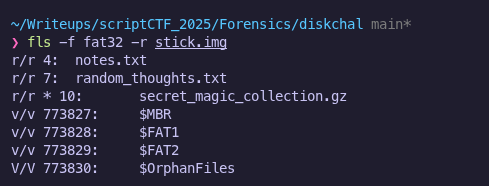

# diskchal | Connor Chang

Description: i accidentally vanished my flag, can u find it for me

stick.img:attachments/stick.img

## Tools Used
- `file` - for identifying file type
- `fls` (SleuthKit) - for listing files in disk images, including deleted ones
- `tsk_recover` (SleuthKit) - for recovering files from disk images
- `7z` - for extracting compresses archives 

---

## Solution
1. **Initial Inspection**
    
    I downloaded the image file and wanted to know more about the file so I used the `file` command to
    investigate and see what format the image was in.

    

2. **Listing Files in the Image**  
   
   Since the image used FAT32, I used `fls` from SleuthKit to list all files, including deleted ones:

   

   This revealed a few text files and a promising compressed archive named `secret_magic_collection.gz`

3. **Recovering Files**

    I used `tsk_recover` to extract the files from the image so I could analyze them:

        

4. **Extracting the Hidden Files**

    I unzipped the archive using `7z`:

    

    Inside, I found `flag.txt`, which contained the flag:
    `"scriptCTF{1_l0v3_m461c_7r1ck5}"`
   