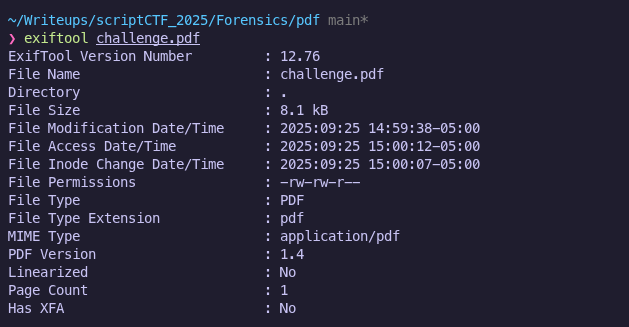

# pdf | Connor Chang

Description: so sad cause no flag in pdf :(

challenge.pdf:attachments/challenge.pdf

## Tools Used
- `exiftool` – for viewing metadata
- `binwalk` – for analyzing and extracting embedded data

---

## Solution
1. **Initial Inspection**
    
    I opened `challenge.pdf` and found only a short message visible in the document.
    

2. **Metadata Check**  
   
   To ensure there was nothing hidden in the file metadata, I ran `exiftool`
   

   The output indicated a normal PDF with no obvious embedded files, so I proceeded to a deeper analysis with `binwalk`.

3. **Binwalk Analysis**
    
    I ran `binwalk` to scan the file for embeddec content

    

    The scan revealed that there was a `Zlib` compressed data block in the PDF file.

4. **Extracting Embedded Data**

    I used `binwalk -e` to automatically carve out and extract embedded content:

    

    This produced an extraction folder that containined a file named `11B`.

5. **Inspecting the Extracted File**

    I inspected the extracted file with `cat` and revealed the hidden flag:
    `"scriptCTF{pdf_s7r34m5_0v3r_7w17ch_5tr34ms}"`

    
